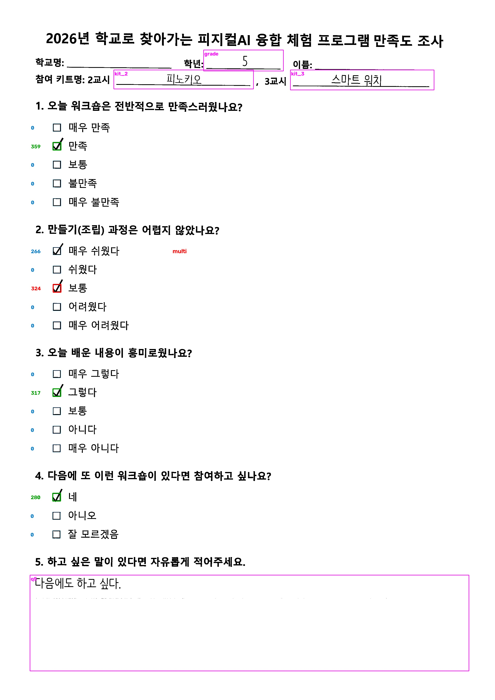
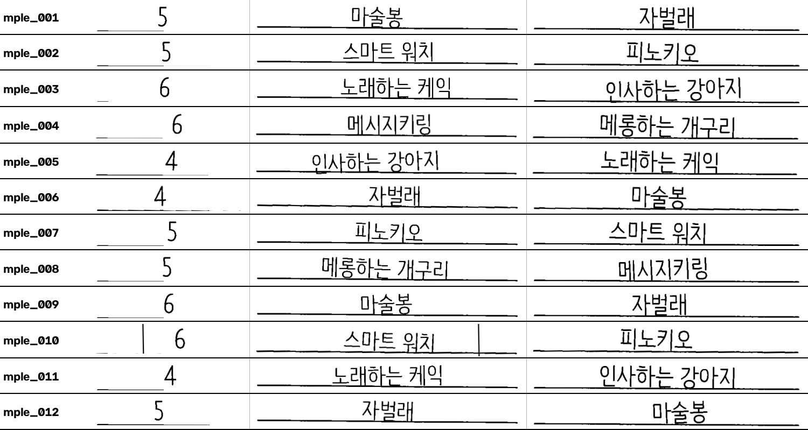
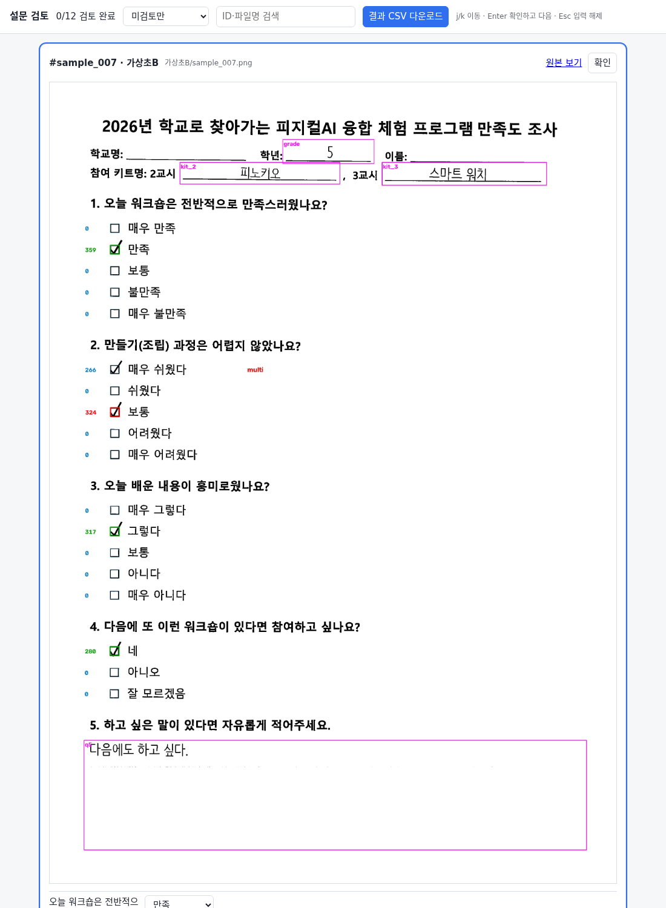

# survey_extracter

워크숍 현장에서 **종이로 받은 설문지 스캔 이미지**에서 응답을 추출하는 도구입니다.

- 체크박스 문항은 OpenCV로 자동 판독합니다(OMR).
- 손글씨 항목(학년·키트명·자유의견)은 잘라낸 이미지를 Claude가 1차 판독하고, 사람이 검토합니다.
- 이중 체크·애매한 체크는 자동으로 플래그를 달아 사람이 검토합니다.
- 결과는 검토 이력과 집계가 들어 있는 `responses_final.xlsx` / `.csv`로 내보냅니다.
- Windows / macOS에서 Python 스크립트로 실행합니다. Claude Skill 패키징은 [#7](../../issues/7)에서 안정화 후 진행합니다.

> 진행 상황은 [Issues](../../issues)를 참고하세요.

## 개인정보 주의

원본 스캔과 추출 결과에는 학생이 쓴 글이 들어 있습니다. `raw/`, `output/`은 `.gitignore`로 제외되어 있으며, 이 저장소의 `samples/`는 모두 **합성(가상) 데이터**입니다. 구글 드라이브 링크 파일(`drive_links.csv`)도 커밋하지 마세요.

## 빠른 시작 (샘플로 체험)

Python 3.10 이상이 필요합니다.

```bash
git clone <저장소 주소> && cd survey_extracter
python -m venv .venv
source .venv/bin/activate          # Windows: .venv\Scripts\activate
pip install -r requirements.txt

python -m survey_extract extract samples/scans -o output --debug
```

`output/`에 아래 [예상 결과물](#예상-결과물)과 같은 파일이 만들어집니다. 정답과 기대 출력은 `samples/truth.csv`, `samples/expected_output/`에 있습니다.

## 사용 방법 A: Python 스크립트

스캔 이미지를 폴더에 모읍니다. **하위 폴더 이름이 학교명(그룹)** 이 됩니다.

```
raw/
  학교A/img001.png
  학교B/img002.png
```

### 1. 추출

```bash
python -m survey_extract extract raw -o output --debug
```

- 방향(180° 뒤집힘)과 기울기를 자동으로 바로잡고 체크박스를 읽습니다.
- `output/responses.csv`: 체크박스 결과와 플래그(`multi`/`blank`/`low_margin`)
- `output/crops/`: 필드별 손글씨 크롭, `output/sheets/`: 판독용 묶음 시트, `output/debug/`: 판정 오버레이
- `output/originals/`: 검토용 원본 사본(거꾸로 스캔된 것은 똑바로 돌려 둠)
- 이미지 ID는 파일명(확장자 제외)이라 파일을 더하거나 빼도 바뀌지 않습니다.

### 2. 손글씨 1차 판독

`output/sheets/`의 시트 이미지를 Claude에게 보여 주고 손글씨를 읽게 합니다.

```bash
python -m survey_extract prompt -o output        # 다음에 읽을 시트와 지침 출력
```

결과는 `output/transcripts/<시트이름>.json`에 저장합니다.

```json
{"sample_001": {"grade": {"text": "5", "conf": "high"}, "kit_2": {"text": "마술봉", "conf": "high"}}}
```

- **보이는 그대로 옮기세요.** 맞춤법 교정이나 문맥 해석을 하면 의미가 뒤집힐 수 있습니다(자유의견은 특히).
- 읽기 어려우면 `conf`를 `low`로 합니다. 빈 칸은 `text`를 비웁니다.

```bash
python -m survey_extract merge -o output          # responses.csv에 합치기
```

### 3. 검토

```bash
python -m survey_extract review output            # output/review.html 생성
```

`review.html`을 브라우저로 엽니다(인터넷 불필요).

- 카드마다 원본 파일명, 크롭/오버레이 이미지, 자동값이 보입니다. 선택·입력을 고치고 `Enter`로 확인합니다.
- `j`/`k` 이동, 필터(미검토만/체크박스 플래그/자유의견 미검토/전체), ID·파일명 검색
- 입력은 브라우저에 자동 저장됩니다. 끝나면 **결과 CSV 다운로드**로 받은 `review_decisions.csv`를 `output/`에 둡니다.
- **자유의견은 `conf`와 관계없이 사람이 전량 확인하는 것을 권장합니다.**

### 4. 내보내기

```bash
python -m survey_extract export output
```

`output/responses_final.xlsx`(시트: 응답·집계·키트·검토이력)와 `responses_final.csv`가 만들어집니다. 검토하지 않은 행이 있으면 목록을 보여 주고 종료 코드 1로 끝납니다.

- 키트명은 `kits.json`의 표준 이름(`kit_2_std`, `kit_3_std`)으로 묶입니다. 표준명을 정하지 못한 값은 `kit_check`에 `확인필요`로 표시됩니다.
- 검토 결과 위에 덮어쓸 수정은 `output/corrections.csv`(`id,field,value`)에 적습니다. 빈 `value`는 "비움"입니다. 브라우저에서 CSV를 다시 받아도 유지됩니다.

### 5. 원본 파일 링크 넣기(선택)

원본을 구글 드라이브에 올렸다면 공유링크를 결과에 넣을 수 있습니다.

1. 원본 폴더(`output/originals/` 권장)를 드라이브에 올립니다. 학생이 쓴 글이 들어 있으니 **필요한 사람에게만** 공유하세요.
2. 파일명과 링크를 `drive_links.csv`로 만듭니다(Apps Script 등으로 목록 추출).

   ```csv
   file,url
   img001.jpg,https://drive.google.com/file/d/.../view
   ```

   `file`은 상대경로 또는 파일명이며 확장자가 달라도(`png`/`jpg`) 매칭됩니다.
3. `python -m survey_extract export output --links drive_links.csv`

`share_url` 열이 엑셀에서 클릭되는 링크로 들어가고, 링크가 없는 행 수는 실행 결과에 표시됩니다.

## 사용 방법 B: Claude Skill

[#7](../../issues/7)에서 안정화 후 패키징합니다. 현재는 방법 A의 2단계(시트를 Claude 대화에 올려 판독)만 대화로 대신할 수 있습니다.

## 예상 결과물

샘플 12장(`samples/scans/`: 정방향·180° 뒤집힘·기울임·이중 체크·무응답·지운 흔적·X 취소 포함)으로 위 순서를 실행한 결과입니다. 파일은 `samples/expected_output/`에 있습니다.

### 추출 결과 (`responses.csv`, 일부)

- 12장 중 8장은 자동 확정, 4장(이중 체크·무응답·지운 흔적·X 취소)은 `needs_review`
- 180° 뒤집힌 3장(`rotated_180=True`)도 정상으로 읽힙니다.

### 판정 오버레이 (`debug/`)

초록 = 확정, 빨강 = 후보(확정 안 됨), 숫자 = 박스 안 잉크 점수입니다. (이중 체크 예: `samples/expected_output/debug/sample_007.jpg`)



### 판독용 묶음 시트 (`sheets/`)



### 검토 화면 (`review.html`)



### 최종 결과 (`responses_final.csv`, 일부)

| id | school | q1 | q2 | q3 | q4 | grade | kit_2_std | kit_3_std | status |
|---|---|---|---|---|---|---|---|---|---|
| sample_001 | 가상초A | 매우 만족 | 쉬웠다 | 매우 그렇다 | 네 | 5 | 마술봉 | 자벌래 | auto |
| sample_004 | 가상초A | 보통 | 어려웠다 | 보통 | 잘 모르겠음 | 6 | 메시지키링 | 메롱하는 개구리 | auto |
| sample_007 | 가상초B | 만족 | 보통 | 그렇다 | 네 | 5 | 피노키오 | 스마트 워치 | reviewed |
| sample_008 | 가상초B | 매우 만족 | 쉬웠다 | (무응답) | 아니오 | 5 | 메롱하는 개구리 | 메시지키링 | reviewed |

`status`: `auto` = 자동 확정, `reviewed` = 사람이 확인. 엑셀에는 학교별·문항별 `집계`, 표준 키트별 `키트`, 자동값→최종값 `검토이력` 시트가 함께 들어 있습니다.

## 샘플 다시 만들기 / 테스트

```bash
pip install -r requirements-dev.txt           # 샘플 생성용(Pillow, ReportLab)
python tools/make_samples.py samples/scans    # 합성 스캔 + samples/truth.csv
python tools/build_expected_output.py         # samples/expected_output/ 재생성
python -m unittest discover tests             # 샘플 기대 동작 + 키트명 규칙 테스트
```

## 문서

- [차기 설문지 양식 제안](docs/form_design_proposal.md): 이번 데이터에서 얻은 근거와 개선안
- [양식·스캔 작성 가이드](docs/form_guidelines.md): 학생/교사용 작성 안내, 스캔 설정 권장
- 스캔 품질 실험 재현: `python tools/scan_quality.py raw output/responses_final.csv`

## 폴더 구조

```
survey_extract/   파이프라인(align, omr, crops, transcribe, review, kits, cli)
tools/            샘플·벤치마크·스캔 품질 실험·양식 PDF 생성
tests/            샘플/키트명 테스트
samples/          합성 스캔, 정답표, 기대 출력
docs/             설계 제안, 가이드
```
