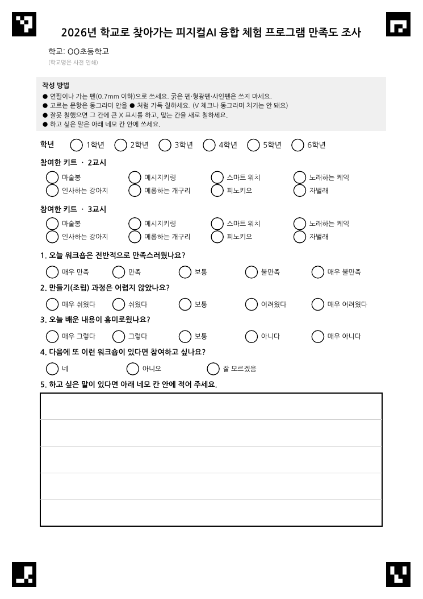

# 차기 설문지 양식 제안

이번 추출(5개교 422장)과 검토에서 얻은 수치를 근거로, 다음 설문지를 어떻게 만들면 **사람이 다시 확인할 일을 줄일 수 있는지** 정리한 제안입니다. 예시 양식은 [`templates/proposed_form.pdf`](../templates/proposed_form.pdf)이며 `python tools/make_proposed_form.py`로 다시 만듭니다.

## 1. 이번 데이터에서 확인된 문제

| 영역 | 근거 | 의미 |
|---|---|---|
| 체크박스 | 1688문항 중 113건(6.7%)이 사람 검토로 넘어감. 그중 이중 체크 90건(5.3%), 무응답 11건, 애매 6건. 자동 확정한 것의 오답은 0건 | 자동 판독 자체는 정확하지만 ✓ 표시의 긴 획이 옆 칸을 침범하거나 수정 흔적이 남아 사람이 개입해야 함 |
| 키트명 | 손글씨로 쓴 값이 2교시 38종, 3교시 44종(실제 키트는 8종). 검토에서 31건 수정 | 철자·수식어("노래하는", "만들기")가 제각각이라 표준화 작업이 따로 필요했음 |
| 학년 | 411건 중 4건 수정(1%) | 대부분 맞지만 "4학년", "6-1"처럼 형식이 섞임 |
| 자유의견 | 367건 중 118건(32%) 수정. 1차 판독이 문맥을 해석해서 의미가 정반대로 바뀐 사례도 있음 | 어린이 글씨·문법 오류가 있어 자동 판독을 믿기 어려움. **사람이 전량 확인해야 함** |
| 필기구 | 굵은 펜·사인펜으로 쓴 글씨는 획이 뭉개져 판독 불가 | 필기구 안내 필요 |
| 필기 영역 | 글씨가 줄 밖으로 나가거나 다른 칸을 침범 | 영역을 네모로 분명히 구획 |
| 칸 오용 | 2교시 칸에 3교시 키트명까지 쓴 경우 | 선택식으로 바꾸면 사라짐 |

> 검토 소요: 299행(체크박스 플래그 또는 손글씨 `low`)을 사람이 검토하는 데 약 2시간이 걸렸다고 보고됨. 자유의견 전량 확인 106건은 별도.

## 2. 제안 내용

### 2-1. 손글씨를 자유의견 하나로 줄이기 (가장 효과가 큼)

- **학교**: 사전 인쇄. 학교별로 PDF를 따로 출력(`--school`)해서 쓰게 함. 오프라인 진행이라 QR은 쓰지 않고, 스캔할 때 학교별 폴더로 나눠 구분함.
- **학년**: 1~6 선택 버블.
- **키트명(2교시/3교시)**: 표준 8종 선택 버블. 표준 이름은 [`survey_extract/kits.json`](../survey_extract/kits.json)과 동일하게 맞춤.
- 이렇게 하면 이번에 사람이 확인한 학년·키트명(약 1,200칸)이 체크박스 판독으로 바뀌어 별도 검증이 필요 없음. 남는 손글씨는 자유의견뿐.

### 2-2. 체크박스 방식: ✓ 대신 "칠하는 원형 버블"

| 방식 | 장점 | 단점 | 판단 |
|---|---|---|---|
| 현행 네모 + ✓ | 아이들이 익숙 | 획이 옆 칸 침범, 수정 흔적 → 이번 이중 체크 5.3% | 개선 대상 |
| **칠하는 원형 버블(제안)** | 칠한 면적/밀도로 판정해 단순·안정. 칸 사이 간격을 넓힐 수 있음 | 칠하는 시간, 연하게 칠하면 애매 | **권장**. 밀도 임계 + `low_margin` 플래그로 처리 |
| 번호 동그라미 치기 | 쓰기 쉬움 | 표시 모양이 다양해 판독 어려움 | 비권장 |
| 온라인 폼(구글폼 등) | 추출·검토 파이프라인 불필요 | 현장 기기·네트워크 필요, 종이 병행 시 이중 입력 | 오프라인 진행에는 해당 없음(참고용) |

- **수정 규칙**: 잘못 칠한 칸에는 큰 X 표시를 하고 맞는 칸을 새로 칠하게 안내함(양식 상단 안내 박스). X는 "취소"를 뜻하는 규칙이며, 현재 코드는 X와 칠한 칸을 구분하지 못해 이 경우를 `multi`로 플래그해 사람이 판정함([#16](https://github.com/AntonSangho/survey_extracter/issues/16) 참고).
- 새 버블 양식은 **판독기(버블용 OMR)를 따로 만들어야 함**. 이 문서와 PDF는 양식 제안이며 아직 구현되어 있지 않음.

### 2-3. 마커

- 오프라인 진행이므로 QR은 넣지 않음. 네 모서리에 ArUco 마커(4×4, ID 0~3). 방향(180° 뒤집힘)·기울기 보정을 마커로 하면 **양식을 바꿀 때마다 기준 템플릿을 새로 만들 필요가 없음**.
- 다만 현재 ORB 템플릿 정합은 422장 모두 성공(실패 0)이라 마커는 필수가 아니라 **양식 변경과 저화질 스캔에 대한 보험**임.

### 2-4. 자유의견 칸

- 두꺼운 테두리의 네모 박스(170×66mm)와 연한 안내선(스캔에서 쉽게 제거 가능). 학생 글씨가 박스를 넘지 않도록 안내.
- 개인정보: 이름 칸을 두지 않았음(분석에 불필요). 안내문에 "이름이나 친구 이름은 쓰지 않아요"를 추가하는 것을 권장.

## 3. 스캔 품질: 지금보다 낮춰도 되나?

실제 스캔 422장을 열화시켜 정합 성공률과 체크박스 판독을 사람이 검토한 최종값과 비교했습니다(`python tools/scan_quality.py raw output/responses_final.csv`). 이번 스캔은 **300dpi 1비트(흑백 이진화)** 였습니다.

| 설정 | 정합 성공 | 자동 확정 오답 | 사람 검토로 넘김 |
|---|---|---|---|
| 300dpi 원본(1비트) | 422/422 | 0 | 5.7% |
| 200dpi 그레이 | 422/422 | 0 | 6.0% |
| 150dpi 그레이 | 422/422 | 0 | 6.0% |
| 100dpi 그레이 | 422/422 | 0 | 5.7% |
| 75dpi 그레이 | 422/422 | 0 | 5.4% |
| 50dpi 그레이 | 422/422 | 4 (0.26%) | 7.8% |
| 40dpi 그레이 | 417/422 | 3 | 15.9% |
| 200 / 150 / 100 / 75dpi 1비트 | 422/422 | 0 | 5.8~6.4% |
| 50dpi 1비트 | 388/422 | 3 | 23.0% |
| 200dpi JPEG q90 / q60 / q30 | 422/422 | 0 | 5.7~5.8% |
| 150dpi JPEG q60 | 422/422 | 0 | 5.9% |

- **체크박스·정합은 75dpi까지 영향이 없었고 50dpi부터 오답이 생김.** 즉 OMR만 보면 해상도를 크게 낮출 수 있음.
- **병목은 손글씨 가독성.** 같은 손글씨를 해상도별로 나란히 보면(작고 가는 글씨 기준) 200~150dpi는 읽히고, 100dpi부터 작은 글씨가 뭉개지며, 75dpi에서는 읽기 어려움.
- 권장: **최소 200dpi, 가능하면 현행 300dpi 유지.** 손글씨가 자유의견 하나로 줄면(2-1) 요구 해상도를 더 낮출 여지가 있음.
- 용량은 낮춰도 이득이 크지 않음(참고치: 300dpi 1비트 PNG ≈ 98KB/장 → 422장 42MB, 200dpi 그레이 JPEG q60 ≈ 168KB/장 → 73MB).

### 한계

- 이번 스캔이 이미 1비트라서 **그레이스케일 스캔이 더 좋은지는 직접 검증하지 못함.** 실험의 "그레이"는 1비트 이미지를 줄여서 만든 것이라 실제 그레이 스캐너 출력(노이즈·그림자 포함)과 다름.
- 손글씨 가독성은 두 장을 눈으로 비교한 결과이며 정량 평가가 아님.
- 새 양식(버블)으로 현 양식 대비 자동 처리율을 비교하는 실험은 **하지 않았음**(버블 판독기 필요). [#10](https://github.com/AntonSangho/survey_extracter/issues/10)의 이 항목은 열려 있음.

## 4. 다음 단계 제안

1. 이 양식으로 소규모 시범(1~2개 학급)을 인쇄·스캔해 실제 칠하는 방식과 수정 규칙을 확인
2. 시범 스캔으로 버블 판독기를 만들고 현 양식 대비 자동 처리율을 측정
3. 그레이스케일 200~300dpi로 스캔해 위 표를 다시 측정
